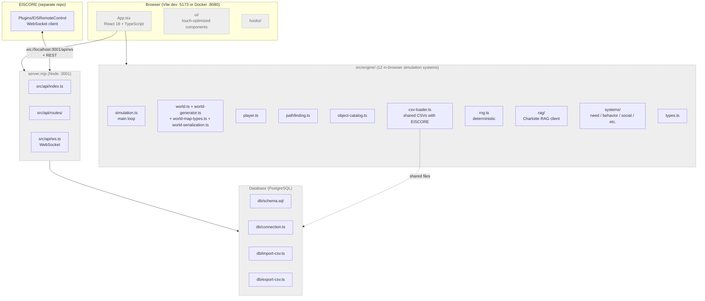
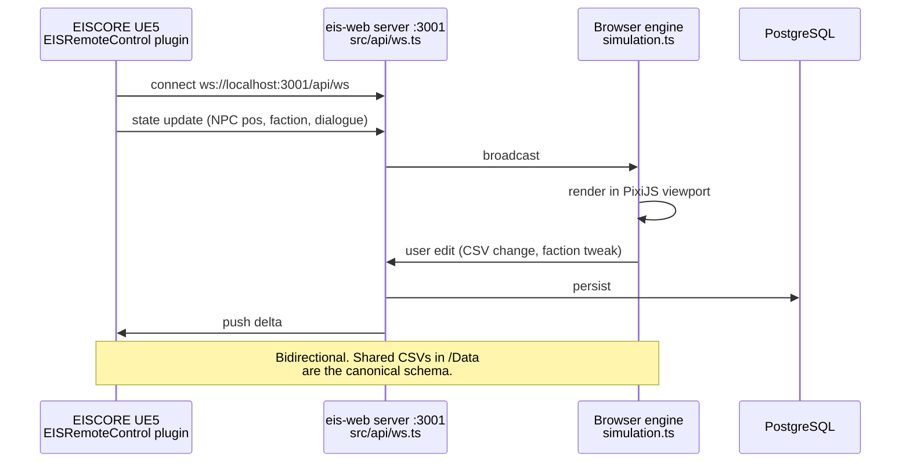

# eis-web — Architecture

**Repository**: `eis-web` (Netrun Systems)
**Role**: Web-based simulation twin / companion for EISCORE (UE5.7)
**Status**: STALLED. Last commit `00288a5 feat: Initial commit for EIS web interface` plus a security redact. Cloud Run target referenced in original deployment notes, but active development has paused (per CURRENT_STATE.md).

This is a web companion for the EISCORE UE5 project. It shares the same CSV files that drive EISCORE DataTables and renders a 2D simulation viewport in the browser. UE5 ↔ web bidirectional sync is over WebSocket + REST (see `docs/UE5_BRIDGE.md`).

---

## 1. System architecture

All boxes shown stalled-style because active development has paused. The deployment surface (server.mjs + Dockerfile + dist/) is present and runnable; new feature work is on hold.

---

## 2. Stack (per `package.json` neighborhood)

| Layer | Tool |
|-------|------|
| Build | Vite |
| UI | React 18 + TypeScript + Tailwind |
| Server | Node `server.mjs` + Express-like routing in `src/api/` |
| WebSocket | `src/api/ws.ts` |
| DB | PostgreSQL via `db/connection.ts` |
| Renderer | PixiJS (per CURRENT_STATE.md description — 2D viewport library) |

---

## 3. UE5 ↔ Web bridge

Protocol spec: `docs/UE5_BRIDGE.md`.

---

## 4. Stalled-state notes

- No README exists (intentional minimal repo state).
- `node_modules/` is committed in working tree (243 entries in `node_modules/`) — typical for legacy Vite scaffolds; not blocking.
- Cloud Run deployment is referenced in CURRENT_STATE.md but no `cloudbuild.yaml` is present in the repo root; deployment was likely ad-hoc.
- If work resumes, the recommended order is: (1) rotate the redacted DB credential into Secret Manager, (2) confirm WebSocket protocol against current EISCORE `Plugins/EISRemoteControl/`, (3) add a README pointing at this ARCHITECTURE.md.

---

## 5. Key files

- `App.tsx` + `main.tsx` — React entry
- `src/engine/` — 12 in-browser simulation modules
- `src/engine/rag/` — Charlotte RAG client
- `src/api/index.ts` + `src/api/routes/` + `src/api/ws.ts` — backend
- `server.mjs` — Node entrypoint
- `db/{schema.sql,connection.ts,import-csv.ts,export-csv.ts}` — PostgreSQL layer
- `docs/UE5_BRIDGE.md` — WebSocket + REST protocol spec
- `Dockerfile` — multi-stage container build
- `dist/` — pre-built static assets
